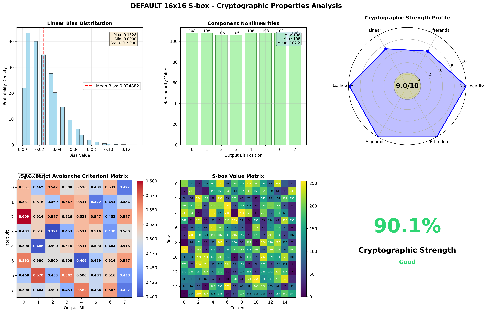
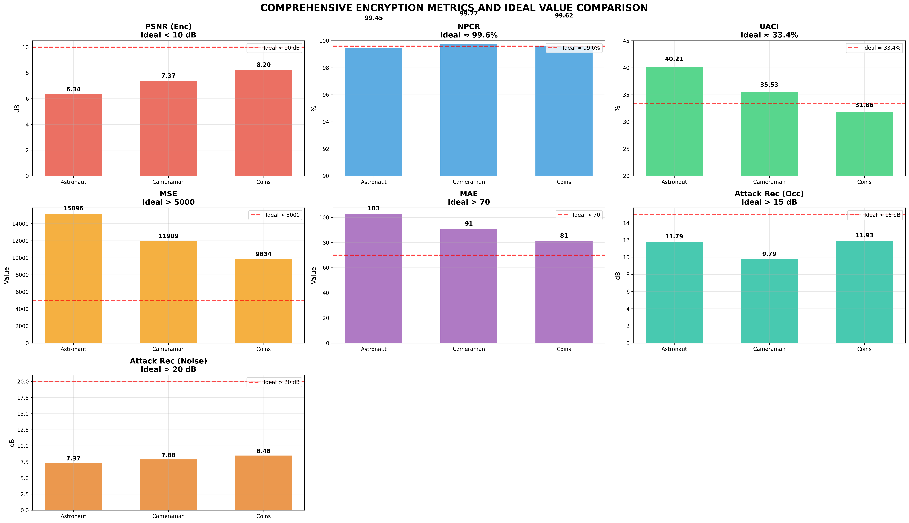

# 🔐 S-box Analyzer & Image Encryption Tool

<div align="center">

**Comprehensive S-box cryptanalysis and image encryption performance evaluation tool**

[Features](#-features) • [Installation](#-installation) • [Quick Start](#-quick-start) • [Documentation](#-documentation) • [Examples](#-example-results)

</div>

---

## 📋 Table of Contents

- [Overview](#-overview)
- [Features](#-features)
- [Installation](#-installation)
- [Quick Start](#-quick-start)
- [Usage Examples](#-usage-examples)
- [Analysis Metrics](#-analysis-metrics)
- [Output Files](#-output-files)
- [Documentation](#-documentation)
- [Example Results](#-example-results)
- [Contributing](#-contributing)
- [License](#-license)
- [Contact](#-contact)

---

## 🎯 Overview

**S-box Analyzer** is a powerful Python tool for comprehensive analysis of Substitution Boxes (S-boxes) used in cryptographic systems. It evaluates both cryptographic properties and image encryption performance, providing detailed reports with visualizations.

### Why Use This Tool?

- ✅ Evaluate S-box cryptographic strength
- ✅ Test image encryption effectiveness
- ✅ Generate publication-ready visualizations
- ✅ Compare multiple S-boxes
- ✅ Automated report generation (PDF, TXT, JSON)

---

## ✨ Features

### 🔒 Cryptographic Analysis
- **Nonlinearity Analysis** - Component and VBF nonlinearity
- **Differential Uniformity** - Resistance to differential cryptanalysis
- **Linear Approximation Probability (LAP)** - Linear attack resistance
- **Strict Avalanche Criterion (SAC)** - Avalanche effect quality
- **Algebraic Degree** - Algebraic complexity
- **Bit Independence Criterion (BIC)** - Output bit independence
- **Autocorrelation Test** - Statistical independence

### 🖼️ Image Encryption Evaluation
- **PSNR/MSE/MAE** - Encryption quality metrics
- **NPCR/UACI** - Differential attack resistance
- **Correlation Analysis** - Horizontal, vertical, diagonal
- **Attack Simulation** - Occlusion and noise attacks
- **Histogram Analysis** - Pixel distribution uniformity

### 📊 Visualization & Reporting
- **Cryptographic Properties** - Radar charts, heatmaps
- **Image Processing** - Encryption/decryption comparison
- **Metrics Comparison** - Bar charts with ideal values
- **Correlation Plots** - Scatter plots for adjacent pixels
- **PDF Reports** - Comprehensive multi-page reports
- **JSON Data Export** - Machine-readable results

---

## 🚀 Installation

### Prerequisites
- Python 3.7 or higher
- pip package manager

### Setup
```bash
git clone https://github.com/nihadqurbanov/sbox-analyzer.git
cd sbox-analyzer
pip install -r requirements.txt
```

---

## 🎬 Quick Start

### 1. Analyze Default S-box
```bash
python src/Sbox_analyzer.py
```

### 2. Interactive Mode
```bash
python src/Sbox_analyzer.py
# Then follow the prompts to select options
```

### 3. Simple Analysis (Without PDF)
```bash
python src/Sbox_analyzer.py --simple
```

---

## 💡 Usage Examples

### Example 1: Analyze Custom S-box
```bash
python src/Sbox_analyzer.py --sbox "210,111,26,106,166,245,79,185,..." --name "My Custom S-box"
```

### Example 2: Load from File
```bash
python src/Sbox_analyzer.py --file Default_sbox.txt --name "Default S-box"
```

**File Format** (`Default_sbox.txt`):
```
210, 111, 26, 106, 166, 245, 79, 185, 158, 238, 207, 144, 85, 235, 74, 51,
22, 213, 36, 14, 157, 161, 190, 113, 167, 209, 155, 195, 120, 61, 42, 230,
...
```

### Example 3: Python Script Integration
```python
from src.Sbox_analyzer import IntegratedSBoxAnalyzer

# Define your S-box
Default_sbox = [210, 111, 26, 106, ...]  # 256 values for 16x16 S-box

# Create analyzer
analyzer = IntegratedSBoxAnalyzer(Default_sbox, "Default S-box")

# Run analysis
crypto_results, image_results = analyzer.run_full_analysis()

# Access results
print(f"Nonlinearity: {crypto_results['nonlinearity']['min']}")
print(f"NPCR: {image_results[0]['npcr']:.2f}%")
```

---

## 📈 Analysis Metrics

### Cryptographic Properties

| Metric | Description | Ideal Value |
|--------|-------------|-------------|
| **Nonlinearity** | Resistance to linear attacks | ≥ n/4 (for n-bit) |
| **Differential Uniformity** | Resistance to differential attacks | ≤ 8 (for 8-bit) |
| **SAC** | Avalanche effect quality | ≈ 0.5 |
| **LAP** | Maximum linear bias | < 0.1 |
| **Algebraic Degree** | Polynomial complexity | ≥ n-1 |
| **BIC-NL** | Bit independence | High values |

### Image Encryption Metrics

| Metric | Description | Ideal Value |
|--------|-------------|-------------|
| **PSNR** | Encryption effectiveness | < 10 dB |
| **NPCR** | Pixel change rate | ≈ 99.6% |
| **UACI** | Intensity change uniformity | ≈ 33.4% |
| **MSE** | Mean squared error | > 5000 |
| **Correlation** | Adjacent pixel correlation | ≈ 0 |

---

## 📁 Output Files

After analysis, the following files are generated:

```
sbox_analysis_2025-01-15_12-30-45/
├── sbox_analysis_2025-01-15_12-30-45.pdf          # Complete PDF report
├── sbox_analysis_2025-01-15_12-30-45.txt          # Detailed text report
├── sbox_analysis_data_2025-01-15_12-30-45.json    # JSON data
├── sbox_crypto_2025-01-15_12-30-45.png            # Cryptographic visualization
├── image_process_2025-01-15_12-30-45.png          # Image encryption process
├── metrics_2025-01-15_12-30-45.png                # Metrics comparison
└── correlation_2025-01-15_12-30-45.png            # Correlation analysis
```

### Sample Outputs

#### Cryptographic Properties Visualization


#### Image Encryption Process


#### Metrics Comparison


---

## 📚 Documentation

Detailed documentation is available in the [`Docs/`](./Docs/) folder:

- **[Analysis Methods](./Docs/Analysis_methods.md)** - Detailed explanation of all cryptographic metrics
- **[S-box Examples](./Docs/Other_sboxes.md)** - Collection of well-known S-boxes for testing
- **[Default S-box Structure](./Docs/Default_sbox_structure.md)** - Structure of the default S-box

---

## 🎓 Example Results

Complete analysis example with all output files is available in [`Example/Default_sbox_analysis/`](./Example/Default_sbox_analysis/)

**Key Results for Default S-box:**
- ✅ Nonlinearity: 112
- ✅ Differential Uniformity: 4
- ✅ SAC Average: 0.5001
- ✅ NPCR: 99.61%
- ✅ UACI: 33.46%

---

## 🔧 Command Line Options

```bash
python src/Sbox_analyzer.py [OPTIONS]

Options:
  --sbox TEXT         S-box values (comma-separated)
  --file PATH         Load S-box from file
  --name TEXT         Custom name for the S-box
  --simple            Simple analysis mode (no PDF/PNG)
  -h, --help         Show help message
```

---

## 🤝 Contributing

Contributions are welcome! Areas for improvement:

- 🔹 **Add support for larger S-boxes** (32×32, etc.)
- 🔹 **Implement additional cryptanalysis methods** (algebraic attacks, etc.)
- 🔹 **Add more image encryption schemes** (multiple rounds, key scheduling)
- 🔹 **Improve visualization aesthetics**
- 🔹 **Add batch processing mode**
- 🔹 **Create GUI interface**
- 🔹 **Add comparative analysis between multiple S-boxes**
- 🔹 **Implement parallel processing for faster analysis**

### How to Contribute

1. Fork the repository
2. Create your feature branch (`git checkout -b feature/AmazingFeature`)
3. Commit your changes (`git commit -m 'Add some AmazingFeature'`)
4. Push to the branch (`git push origin feature/AmazingFeature`)
5. Open a Pull Request

### Development Guidelines
- Follow PEP 8 style guide
- Add docstrings to new functions
- Update documentation for new features
- Test with multiple S-box sizes

---

## 📝 Citation

If you use this tool in your research, please cite:

```bibtex
@software{sbox_analyzer_2025,
  title={S-box Analyzer: Comprehensive Cryptanalysis and Image Encryption Tool},
  author={Nihad Qurbanov},
  year={2025},
  url={https://github.com/nihadqurbanov/sbox-analyzer}
}
```

---

## 📄 License

This project is licensed under the MIT License - see the [LICENSE](LICENSE) file for details.

```
MIT License - Copyright (c) 2025 Nihad Qurbanov
```

---

## 📧 Contact

**Project Maintainer:** Nihad Qurbanov
- 📧 Email: nihad.qurbanov@hotmail.com
- 🐙 GitHub: [@nihadqurbanov](https://github.com/nihadqurbanov)

---

## 🌟 Acknowledgments

- Built with Python, NumPy, Matplotlib, and scikit-image
- Inspired by modern cryptographic analysis techniques
- Thanks to all contributors and users

---

<div align="center">


***Made with by Nihad Qurbanov***

</div>